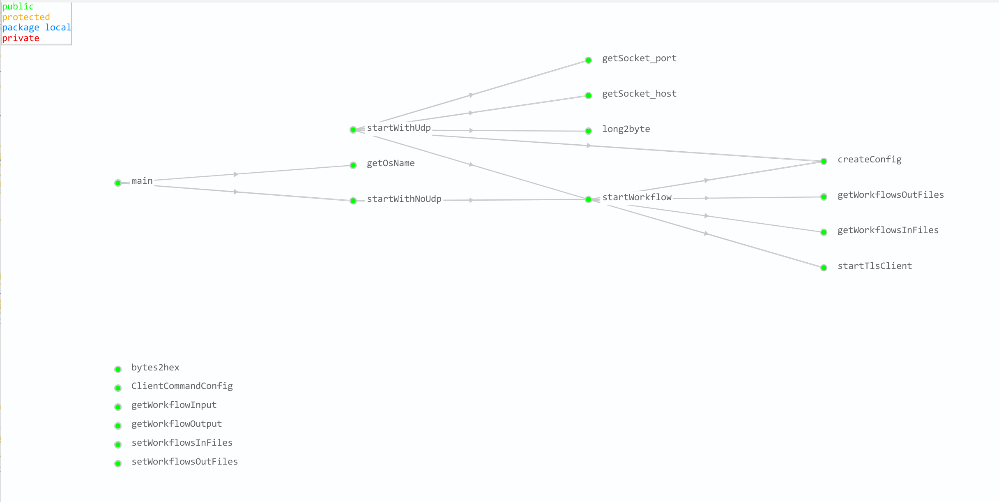

# update 2022-08-24 01:25:23

## 函数调用图



## 说明

1. 通过`resources/keys/genkey.sh`生成key, 仅支持unix系统
2. 通过`getOsName`判断是否为`unix`系统
3. 支持使用`udp`通信模块与fuzz进行通信模式发送消息与不通信直接发送消息两种模式
4. 默认使用`非udp`模式进行发送
5. 通过`-workflow_in_files <path/file>` 参数指定输入的种子文件夹
6. 通过`-workflow_out_files <path/file>` 参数指定记录`workflow trace`执行记录
7. 默认不开启`deubg`模式，默认只显示`info/error`级别消息,通过添加`-debug`参数开启`debug`消息

## example

```bash
#此目录下: mvn install 编译OpenSSL_Client.jar包，
#会在此目录下生成apps/OpenSSL_Client.jar
mvn install  

java -jar <path/to/OpenSSL_Client.jar> -connect localhost:4433 \
          -key <path/to/key.pem> \
          -cert <path/to/cert.pem> \
          -workflow_in_files <path/to/seedfiles> \
          -workflow_out_files <path/to/logseedfiles>
          
exp:
java -jar ./apps/OpenSSL_Client.jar  -connect localhost:4433 \
          -key ./OpenSSL_Client/resources/keys/dsa3072_key.pem \
          -cert ./OpenSSL_Client/resources/keys/dsa3072_cert.pem \
          -workflow_in_files ./OpenSSL_Client/resources/workflows/ \
          -workflow_out_files ./OpenSSL_Client/resources/aftworkflows/

```

## Usage

```bash
Usage: <main class> [options]
  Options:
    -alias
      Alias of the key to be used from Java Key Store (JKS)
    -cert
      PEM encoded certificate file
    -cipher
      TLS cipher suites to use, divided by a comma, e.g. 
      TLS_RSA_WITH_AES_128_CBC_SHA,TLS_RSA_WITH_AES_256_CBC_SHA 
    -compression
      TLS compression methods to use, divided by a comma. (currently, only 
      NULL compression is supported)
    -config
      This parameter allows you to specify a default TlsConfig
  * -connect
      Who to connect to. Syntax: localhost:4433
    -debug
      Show extra debug output (sets logLevel to DEBUG)
      Default: false
    -heartbeat_mode
      Sets the heartbeat mode
      Possible Values: [PEER_ALLOWED_TO_SEND, PEER_NOT_ALLOWED_TO_SEND]
    -h, -help
      Prints usage for all the existing commands.
    -key
      PEM encoded private key
    -keylogfile
      Path to the keylogfile
    -keystore
      Java Key Store (JKS) file to use as a certificate
    -list
      Plot a list of available parameters
      Possible Values: [ciphers, filters, groups, sign_hash_algos, workflow_trace_types]
    -max_fragment_length
      Maximum fragment length definition for the max fragment length TLS 
      extension (possible byte values 1,2,3, or 4)
    -named_group
      Named groups to be used, divided by a comma
    -output_filter
      Apply given filters to the workflow trace before writing to output file. 
      Supply as comma separated list. Try also: -list filters.
    -password
      Java Key Store (JKS) file password
    -point_formats
      Sets the elliptic curve point formats, divided by a comma
    -quiet
      No output (sets logLevel to NONE)
      Default: false
    -server_name
      Server name for the SNI extension.
    -signature_hash_algo
      Supported Signature and Hash Algorithms separated by comma eg. 
      RSA-SHA512,DSA-SHA512 
    -starttls
      Starttls protocol
      Default: NONE
      Possible Values: [NONE, FTP, IMAP, POP3, SMTP]
    -timeout
      Timeout for socket connection
    -transport_handler_type
      Transport Handler type
      Possible Values: [TCP, EAP_TLS, UDP, STREAM, TCP_TIMING, UDP_TIMING, UDP_PROXY, TCP_PROXY_TIMING, TCP_NO_DELAY, TCP_FRAGMENTATION]
    -version
      Highest supported protocol version
      Possible Values: [SSL2, SSL3, TLS10, TLS11, TLS12, TLS13, TLS13_DRAFT14, TLS13_DRAFT15, TLS13_DRAFT16, TLS13_DRAFT17, TLS13_DRAFT18, TLS13_DRAFT19, TLS13_DRAFT20, TLS13_DRAFT21, TLS13_DRAFT22, TLS13_DRAFT23, TLS13_DRAFT24, TLS13_DRAFT25, TLS13_DRAFT26, TLS13_DRAFT27, TLS13_DRAFT28, DTLS10_DRAFT, DTLS10, DTLS12, GREASE_00, GREASE_01, GREASE_02, GREASE_03, GREASE_04, GREASE_05, GREASE_06, GREASE_07, GREASE_08, GREASE_09, GREASE_10, GREASE_11, GREASE_12, GREASE_13, GREASE_14, GREASE_15]
    -workflow_in_files
      A path to workflow trace files
    -workflow_input
      A path to a workflow trace that should be exeucted
    -workflow_out_files
      A path to execute workflow trace file to save
    -workflow_output
      A path in which the executed workflow trace should be stored in
    -workflow_trace_type
      Type of the workflow trace
      Possible Values: [FULL, HANDSHAKE, DYNAMIC_HANDSHAKE, DYNAMIC_HELLO, HELLO, SHORT_HELLO, RESUMPTION, FULL_RESUMPTION, CLIENT_RENEGOTIATION_WITHOUT_RESUMPTION, CLIENT_RENEGOTIATION, SERVER_RENEGOTIATION, DYNAMIC_CLIENT_RENEGOTIATION_WITHOUT_RESUMPTION, HTTPS, DYNAMIC_HTTPS, SSL2_HELLO, SIMPLE_MITM_PROXY, TLS13_PSK, FULL_TLS13_PSK, ZERO_RTT, FULL_ZERO_RTT, FALSE_START, RSA_SYNC_PROXY]
    socket_host
      flag socket to fuzz's host
      Default: localhost
    socket_port
      flag with socket to fuzz's port
      Default: 9998
```